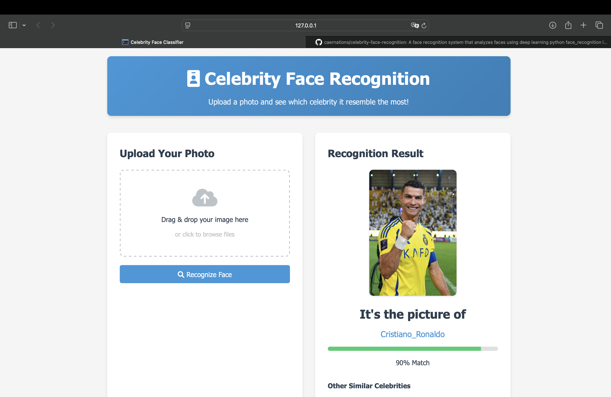
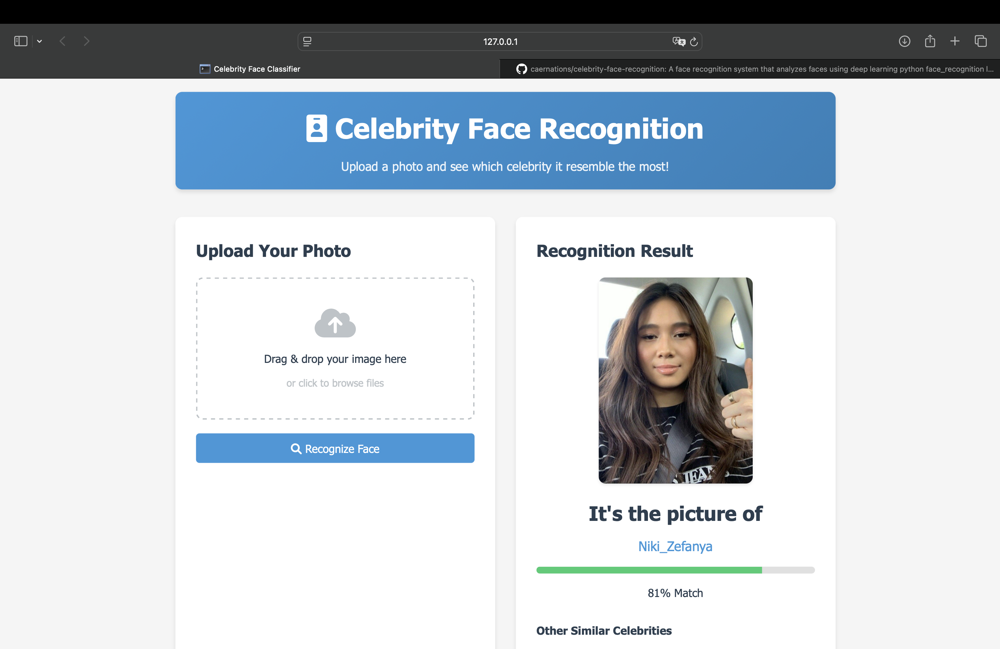
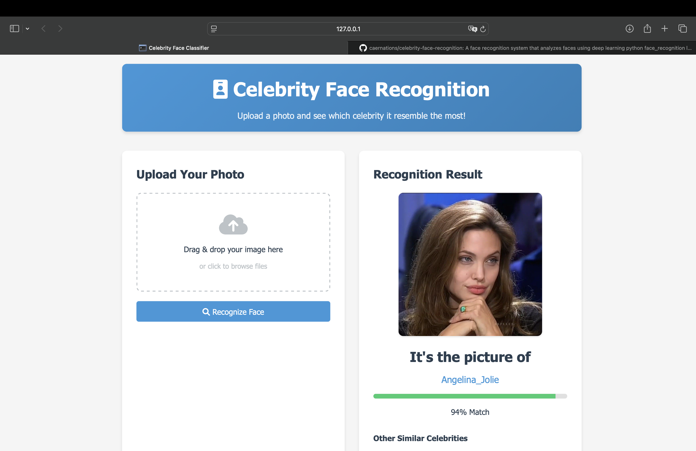

# Celebrity Face Classifier

This AI system uses deep learning and computer vision techniques to analyze faces. It extracts detailed facial data from uploaded images and compares it to a large database of celebrity faces. The system then provides accurate matches, showing how confident it is in the result.

## Demo




## Features

- **Image Upload**: Upload any image and get the most similar celebrity match.
- **Real-time Classification**: Get the classification result instantly, showing the predicted celebrity and confidence percentage.
- **Similarity Comparison**: View similar celebrities based on the uploaded image.

## Tech Stack

- **Flask**: A lightweight WSGI web application framework in Python used to build the web app.
- **Face Recognition**: A Python library for face recognition tasks based on deep learning.
- **JavaScript**: Handles the dynamic frontend interaction.
- **HTML/CSS**: Provides a simple and clean user interface.

## Installation

### 1. Clone the Repository

```bash
git clone https://github.com/caernations/celebrity-face-recognition.git
cd celebrity-face-recognition
```

### 2. Install Dependencies

Install all the required libraries using pip:

```bash
pip install -r requirements.txt
```

### 3. Prepare the Dataset

The dataset used for training the model was downloaded from various sources, including:

- **Kaggle**: [Celebrity Face Image Dataset](https://www.kaggle.com/datasets/vishesh1412/celebrity-face-image-dataset)
- **Google**: Images gathered from public sources using web scraping.
- **Pinterest**: Public celebrity boards.

You need to download the dataset and place it in the `Celebrity_Faces_Dataset/` folder in the project directory.

```bash
Celebrity_Faces_Dataset/
    Angelina_Jolie/
    Brad_Pitt/
    Cristiano_Ronaldo/
    ...
```

### 4. Generate Face Encodings

Before running the application, you need to generate face encodings from your dataset:

```bash
python encodings_generator.py
```

This process may take some time depending on the size of your dataset. It will create `encodings.npy` and `names.npy` files that are required for the face recognition functionality.

### 5. Running the Application

After generating the encodings, run the Flask application with the following command:

```bash
python main.py
```

The app will be accessible in your browser at `http://127.0.0.1:5000`.

## Usage

1. **Upload Image**: Click on the "Upload Your Photo" button, or drag and drop your image into the designated area.

2. **Classify**: Once you submit the image, the system will classify it and display the most similar celebrity, along with the confidence percentage.

3. **See Results**: Below the classification result, you will also see other similar celebrities based on the uploaded photo.

## Example

- **Uploaded Image**: A random photo of a person.
- **Predicted Celebrity**: Jennifer Lawrence.
- **Confidence**: 82% Match.

## Folder Structure

```bash
celebrity-face-classifier/
    ├── Celebrity_Faces_Dataset/  # Celebrity images dataset
    ├── uploads/                  # Folder to store uploaded images
    ├── templates/                # Folder for HTML templates
        └── index.html            # Main HTML template
    ├── .gitignore                # Files to ignore in Git
    ├── requirements.txt          # List of Python dependencies
    ├── main.py                   # Flask backend to serve the app
    ├── encodings_generator.py    # Script to generate encodings for face recognition
    ├── setup.py                  # Setup script for directories and placeholders
    ├── encodings.npy             # Encoded face data for known celebrities
    ├── names.npy                 # Celebrity names corresponding to encodings
    ├── README.md                 # Project documentation
```

## Acknowledgments

- **Face Recognition**: This project uses the face_recognition Python library to detect and compare faces.
- **Dataset**: The celebrity face images are sourced from:
  - [Kaggle Celebrity Face Dataset](https://www.kaggle.com/datasets/vishesh1412/celebrity-face-image-dataset)
  - Google: Images gathered from public sources using web scraping.
  - Pinterest: Public celebrity boards.